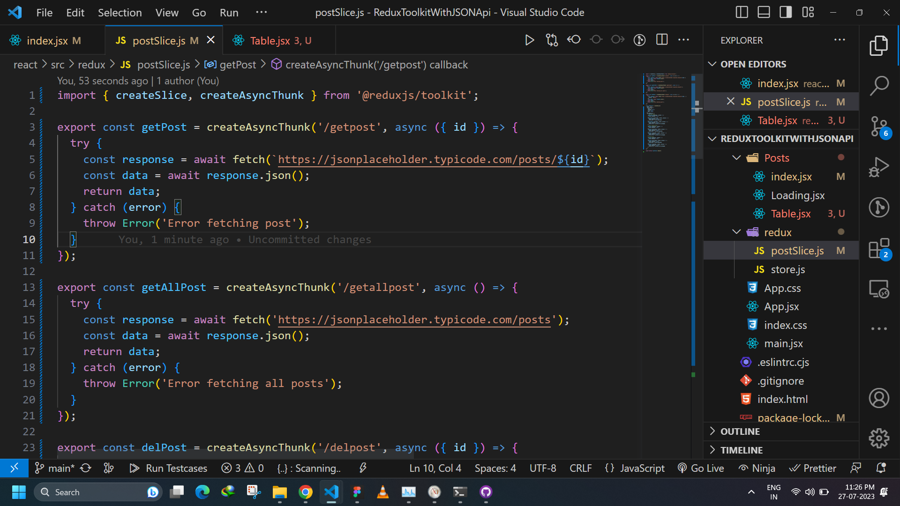
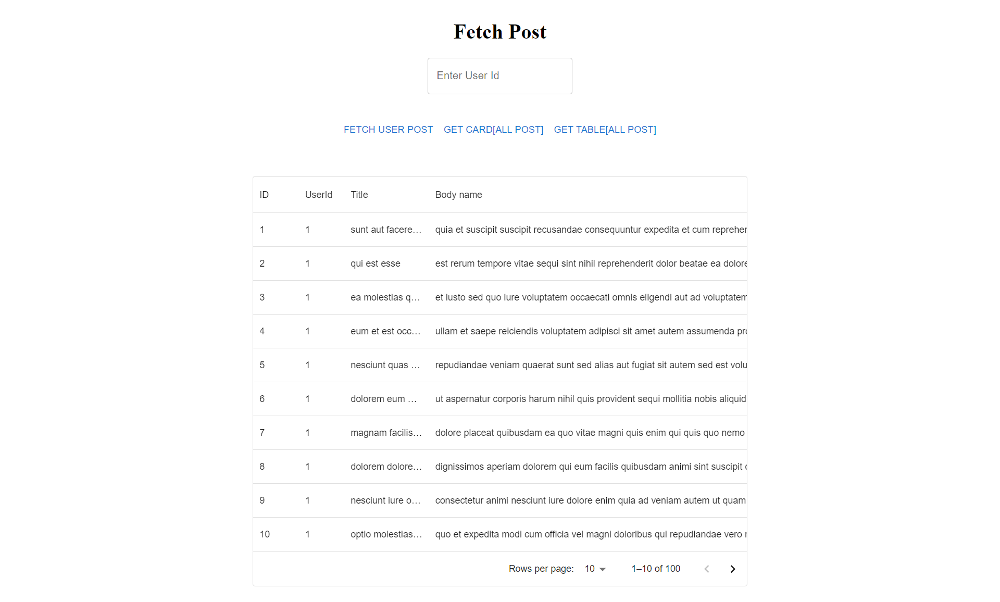
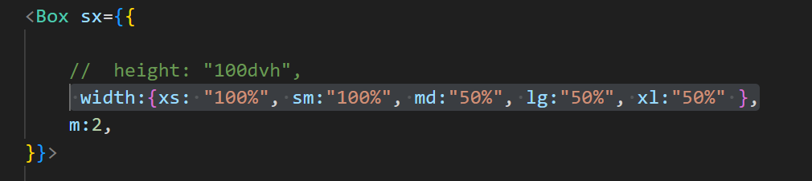
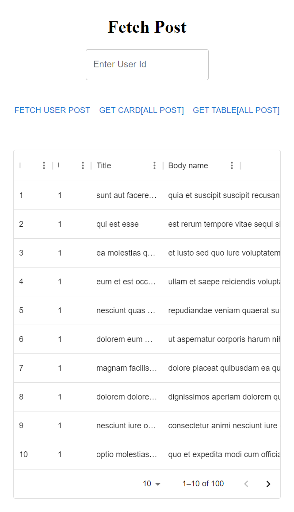
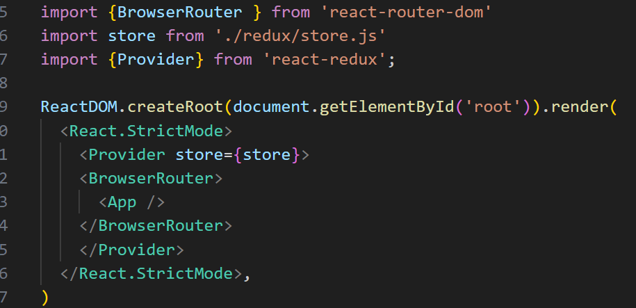

# ReduxToolkitWithJSONApi

✅Used JSONApi = https://jsonplaceholder.typicode.com/posts✅

# Features  
✅Get All Posts[On MUI Card , Table] ✅  
✅Search Post By User Id✅  
✅Delete Post By User Id✅

<h3>1. Give an example of an async await based function to fetch data from the JSON placeholder API ?</h3>

<h3>2. Display the results from above in a MUI table that only takes half of the screen width on laptop screens and full screen width on mobile screen ?</h3>

In Laptop

To Achieve Responsiveness

In Phone

<h3>3.  How do you pass the redux store to the react app ?</h3>

I Have Passed the store in Parent component main.tsx so that whole app can access the redux store.